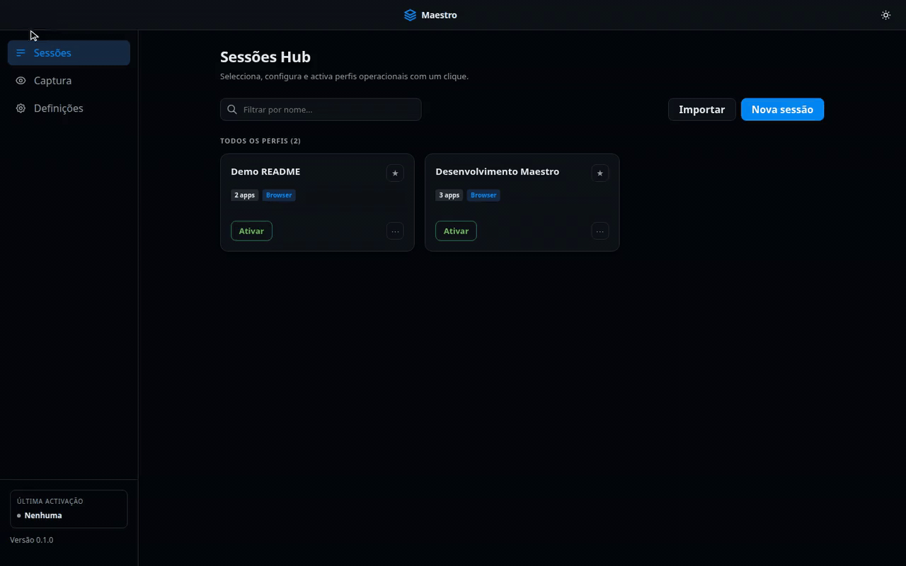
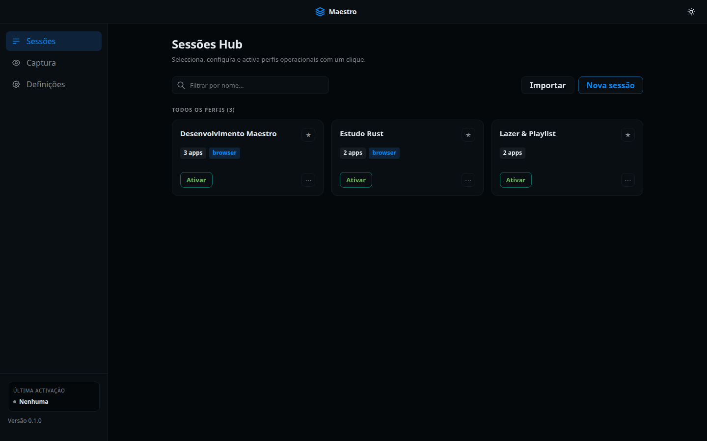
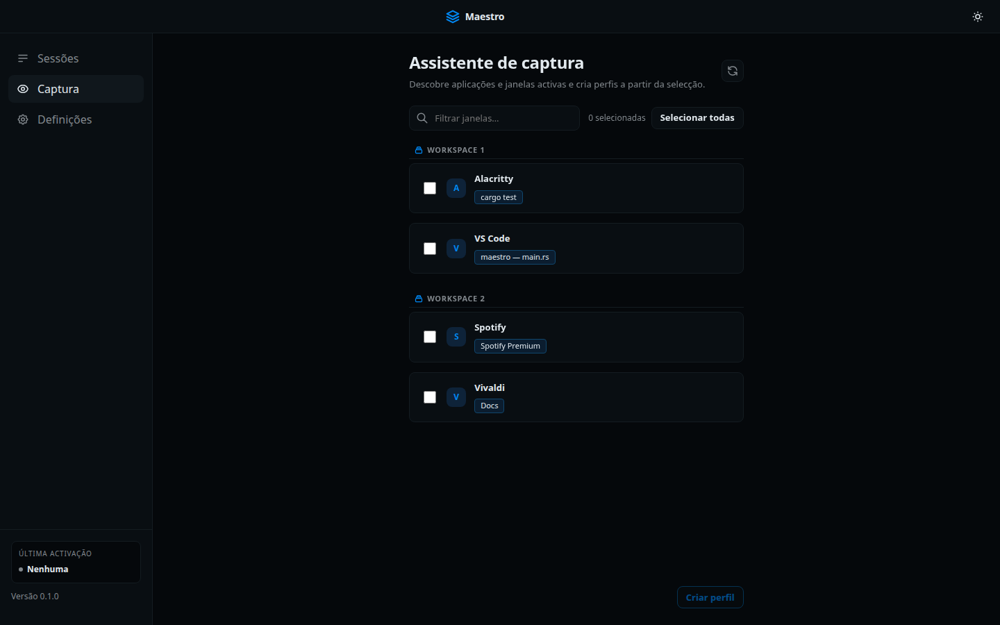
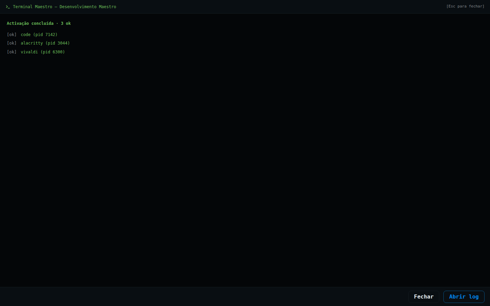
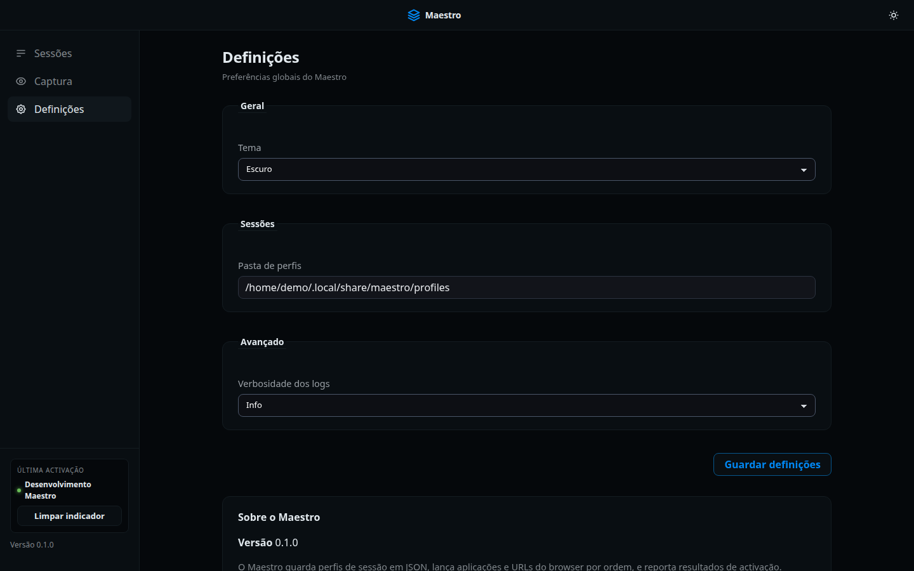

# Maestro

[](https://github.com/DaltonDjoesman/maestro-sessionManager/actions/workflows/ci.yml)

**Linux session launcher** — describe a work session as JSON (apps + browser URLs), capture what’s already open, and activate it in one click.

Maestro is a **personal portfolio project** (Tauri 2 + React + Rust). It launches processes from profiles; it is **not** a window manager and does **not** tear down or kill apps you launched.

**Download:** [Releases](https://github.com/DaltonDjoesman/maestro-sessionManager/releases) — Linux `.deb` / AppImage (v0.1.0+). To build from source, see [Quick start](#quick-start).

## About

Built by [DaltonDjoesman](https://github.com/DaltonDjoesman) as a personal portfolio project. Highlights:

- End-to-end desktop app: React UI → Tauri IPC → Rust services
- Session activation pipeline (spawn, preview/dry-run, step timeline)
- Linux capture assistant (process/window discovery, compositor-aware adapters)
- CI (`cargo test`, Vitest, `npm run build`)

## Reading guide

| Audience | Start here |
|----------|------------|
| **Recruiter / quick scan** | [Demo](#demo), [Screenshots](#screenshots), [Problem](#problem) |
| **Developer** | [docs/architecture.md](docs/architecture.md), [docs/linux-desktop.md](docs/linux-desktop.md) |
| **Try it** | [Releases](https://github.com/DaltonDjoesman/maestro-sessionManager/releases) or [Quick start](#quick-start) |

## Problem

Starting a familiar Linux work setup usually means manually opening the same apps and URLs every time. Maestro keeps that recipe in a local profile and replays it when you hit **Ativar**.

## Positioning / non-goals

| Maestro does | Maestro does not |
|--------------|------------------|
| Store session profiles as local JSON | Act as a window manager |
| Launch apps and browser URLs from a profile | Place windows on workspaces |
| Capture running windows into a draft profile | Scrape open browser tabs |
| Show activation results (step timeline + optional log) | Tear down / kill launched processes |
| Prefer Cosmic / Pop!_OS; degrade elsewhere | Claim multi-distro feature parity yet |

Clearing the sidebar “última activação” label only resets UI state — launched apps keep running.

## Demo



*Select a session → **Ativar** → results overlay → apps and URLs on the desktop (Pop!_OS).*  
Higher quality: [MP4](docs/screenshots/maestro-activate-demo.mp4) / [WebM](docs/screenshots/maestro-activate-demo.webm).

## Screenshots

UI locale: **pt-PT** (English i18n scaffold only — no locale switcher yet).

| Session hub | Capture assistant |
|-------------|-------------------|
|  |  |

| Activation results | Settings |
|--------------------|----------|
|  |  |

Notes, demo video checklist, and regenerate scripts: [`docs/screenshots/`](docs/screenshots/).

## Stack

- **Tauri 2** desktop shell
- **React 19** + Vite UI — default locale **pt-PT**. An `en` locale module exists as an **i18n scaffold only** (stub / alias); there is no locale switcher and no shipped English UI yet.
- **Rust** core: profiles, settings, activation, capture, platform adapters

## Quick start

### Prerequisites

- [Rust](https://www.rust-lang.org/learn/get-started)
- [Node.js](https://nodejs.org/) (LTS)
- Linux desktop deps: [Tauri prerequisites](https://tauri.app/start/prerequisites/)

On Pop!_OS / Ubuntu:

```bash
sudo apt update
sudo apt install -y libwebkit2gtk-4.1-dev build-essential curl wget file \
  libxdo-dev libssl-dev libayatana-appindicator3-dev librsvg2-dev
```

### Development

```bash
npm install
npm run tauri dev
```

### Release build (Pop!_OS / Ubuntu)

```bash
npm install
npm run tauri build
```

Artifacts land under `src-tauri/target/release/bundle/` (e.g. `.deb`, AppImage depending on bundler targets). See [docs/packaging.md](docs/packaging.md) and [docs/releasing.md](docs/releasing.md).

## Architecture (short)

```
React app shell (hub / editor / capture / settings)
        │  Tauri IPC (invoke)
        ▼
Rust lib (profiles, settings, activation, capture, platform)
        │
        ▼
OS: spawn apps/browser · list windows · write local JSON
```

Activation returns a step timeline to an in-app overlay. Profiles and settings stay on disk — no cloud accounts. Full overview: [docs/architecture.md](docs/architecture.md). Also: [docs/linux-desktop.md](docs/linux-desktop.md), [docs/session-profile-schema.md](docs/session-profile-schema.md).

## Security

- Profiles and application settings are **local JSON** on your machine.
- There are **no cloud accounts**, sync services, or telemetry in this project.
- Treat imported profile JSON like any local config: only open files you trust.

## License and third-party deps

This project’s source is released under the [MIT License](LICENSE).

**Source license vs binary deps:** shipping a binary that links GPL-licensed crates (notably Cosmic protocol bindings such as `cosmic-protocols`) can trigger GPL obligations for that binary distribution. Review dependency licenses before redistributing packaged builds; the MIT grant above covers Maestro’s own source as published in this repository.

## Contributing

This is a personal portfolio repo. Small fixes and issues are welcome — see [CONTRIBUTING.md](CONTRIBUTING.md).

## Docs map

| Doc | Purpose |
|-----|---------|
| [docs/architecture.md](docs/architecture.md) | System layers, IPC map, key flows |
| [docs/releasing.md](docs/releasing.md) | Tag + GitHub Release with Linux installers |
| [docs/smoke-test-checklist.md](docs/smoke-test-checklist.md) | Manual QA after `tauri dev` / release |
| [docs/session-profile-schema.md](docs/session-profile-schema.md) | Profile JSON fields |
| [docs/examples/](docs/examples/) | Example profiles for smoke tests / demo recording |
| [docs/screenshots/](docs/screenshots/) | Screenshots + README demo video checklist |
| [docs/follow-up-craft.md](docs/follow-up-craft.md) | Deferred craft (CLI, hotkeys, templates) |
| [docs/packaging.md](docs/packaging.md) | Packaging notes |
| [docs/linux-desktop.md](docs/linux-desktop.md) | Desktop / compositor notes |
| [docs/backend-workflow.md](docs/backend-workflow.md) | Agent-oriented backend workflow |
| [design/](design/) | UI prototype / handoff assets |
