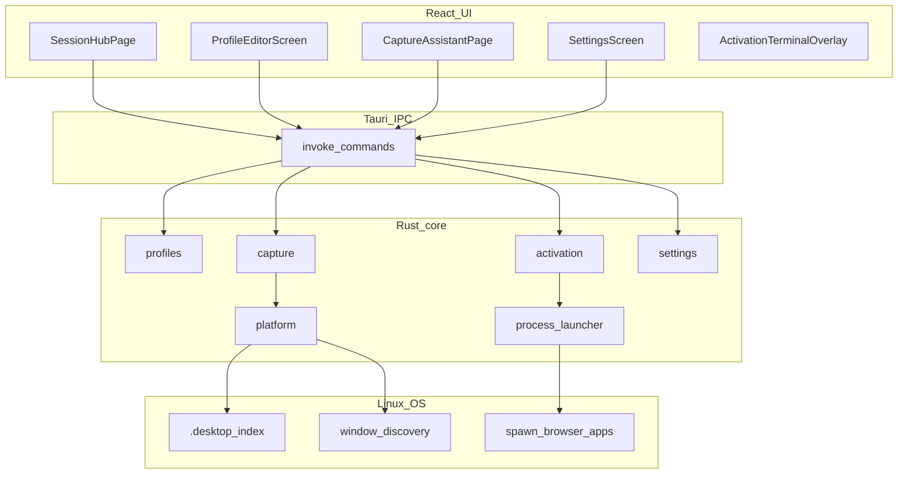

# Maestro architecture

Human-readable overview of how the desktop app is layered. For agent-oriented backend workflow (TDD skills, commit habits), see [backend-workflow.md](./backend-workflow.md). Product boundaries (launcher-only non-goals) live in the [README](../README.md).

## Overview

Maestro is a **Linux session launcher**: local JSON profiles describe apps and browser URLs; the Rust core spawns them and returns a step timeline to the React UI. It does **not** place windows, scrape browser tabs, or tear down processes.

## IPC command map

Commands are registered in [`src-tauri/src/lib.rs`](../src-tauri/src/lib.rs).

| Domain | Command | Role |
|--------|---------|------|
| Settings | `get_settings` | Read persisted application settings |
| Settings | `save_settings` | Validate and write settings |
| Settings | `validate_profiles_root` | Check profiles directory path |
| Settings / OS | `detect_system_default_browser` | Hint for browser family / executable |
| Clipboard | `read_clipboard_text` | Read clipboard (capture / paste helpers) |
| Capture | `list_assistant_running_apps` | Running-app candidates for Captura |
| Profiles | `list_session_profiles` | Catalog entries for the hub |
| Profiles | `load_session_profile` | Load one profile JSON |
| Profiles | `save_session_profile` | Persist editor changes |
| Profiles | `create_session_profile` | Create empty profile |
| Profiles | `delete_session_profile` | Remove profile file |
| Profiles | `duplicate_session_profile_with_name` | Duplicate with new display name |
| Profiles | `import_session_profile_json` | Import JSON + display name |
| Activation | `preview_session_activation` | Dry-run: planned argv / labels, no spawn |
| Activation | `activate_session_profile` | Spawn apps/browser; return step timeline |

## Key flows

### Activate

1. Hub or editor calls `activate_session_profile` (or `preview_session_activation` for dry-run).
2. Rust validates the profile, plans steps (browser block then applications), and either returns the plan or spawns via `process_launcher`.
3. Results (success / skip / fail per step, optional log path) return to the UI.
4. [`App.tsx`](../src/App.tsx) opens `ActivationTerminalOverlay` and may update the sidebar “last activation” label.

Clearing that label is **UI-only** — launched processes keep running.

### Capture assistant

1. Captura (sidebar or editor tab) calls `list_assistant_running_apps`.
2. Rust merges process lists, `.desktop` index, and window discovery (X11/`wmctrl`, Wayland foreign-toplevel, Cosmic workspace enrichment when available).
3. Candidates are scored as `app` vs `process`; the UI lets the user append selected rows into a draft profile.

Compositor honesty and scoring tables: [linux-desktop.md](./linux-desktop.md).

## Frontend structure

| Piece | Location | Notes |
|-------|----------|--------|
| Shell / routes | `src/layout/AppShell.tsx`, `Sidebar.tsx` | Sessões, Captura, Definições; Editor while editing |
| Hub | `src/pages/SessionHubPage.tsx` | Catalog cards, import/export, activate / preview |
| Capture | `src/pages/CaptureAssistantPage.tsx` | Standalone capture |
| Editor / settings | `src/components/ProfileEditorScreen.tsx`, `SettingsScreen.tsx` | Sticky header actions; theme + profiles root |
| Overlay state | `src/App.tsx` | Activation / preview overlay mode and payloads |
| i18n | `src/i18n/` | Default **pt-PT**; `en` is a scaffold stub only |

## Data on disk

| Data | Default location |
|------|------------------|
| Application settings | `$XDG_CONFIG_HOME/maestro/settings.json` (typically `~/.config/maestro/settings.json`) |
| Session profiles | `$XDG_DATA_HOME/maestro/profiles/` (typically `~/.local/share/maestro/profiles/`) — overridable in Definições |

Profile JSON fields: [session-profile-schema.md](./session-profile-schema.md). Examples: [docs/examples/](./examples/).

## Testing

| Layer | Command |
|-------|---------|
| Rust unit / integration | `cd src-tauri && cargo test` |
| Frontend unit | `npm test` (Vitest) |
| Frontend production build | `npm run build` |
| Manual desktop QA | [smoke-test-checklist.md](./smoke-test-checklist.md) after `npm run tauri dev` |

CI runs frontend build, Vitest, and Rust tests (see `.github/workflows/ci.yml`). Packaging a `.deb` / AppImage is a local / release step — [releasing.md](./releasing.md).
